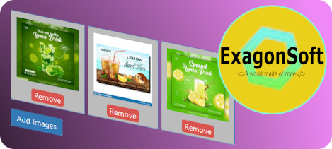

[![Contributors][contributors-shield]][contributors-url]
[![Forks][forks-shield]][forks-url]
[![Stargazers][stars-shield]][stars-url]
[![Issues][issues-shield]][issues-url]
[![MIT License][license-shield]][license-url]
[![Sponsors][sponsors-shield]][sponsors-url]
[![LinkedIn][linkedin-shield]][linkedin-url]

<!-- PROJECT LOGO -->
<br />
<p align="center">
  <a href="https://github.com/exagonsoft/React-Picture-Manager">
    
  </a>

  <h3 align="center">React-Pictures-Manager</h3>

  <p align="center">
    Simple picture manager to help you in your react apps.
    <br />
    <a href="https://github.com/exagonsoft/React-Picture-Manager/settings"><strong>Explore the docs »</strong></a>
    <br />
    <br />
    <a href="https://github.com/exagonsoft/React-Picture-Manager/settings">View Demo</a>
    ·
    <a href="https://github.com/exagonsoft/React-Picture-Manager/issues">Report Bug</a>
    ·
    <a href="https://github.com/exagonsoft/React-Picture-Manager/issues">Request Feature</a>
  </p>
</p>

<!-- TABLE OF CONTENTS -->

## Table of Contents

- [About the Project](#about-the-project)
  - [Built With](#built-with)
- [Getting Started](#getting-started)
  - [Prerequisites](#prerequisites)
  - [Installation](#installation)
- [Usage](#usage)
- [Roadmap](#roadmap)
- [Contributing](#contributing)
- [License](#license)
- [Contact](#contact)
- [Acknowledgements](#acknowledgements)

<!-- ABOUT THE PROJECT -->

## About The Project

[![Product Name Screen Shot][product-screenshot]](https://example.com)

### Built With

- [Node JS](https://nodejs.org)
- [React JS](https://reactjs.org)
- [CSS](https://www.w3schools.com)

<!-- GETTING STARTED -->

## Getting Started

To get a local copy up and running follow these simple steps.

### Prerequisites

This is an example of how to list things you need to use the software and how to install them.

- npm

```sh
npm install npm@latest -g
```

- React

```sh
npm install react
```

### Local Installation

1. Clone the repo

```sh
git clone https://github.com/exagonsoft/React-Picture-Manager.git
```

2. Install NPM packages

```sh
npm install
```

<!-- USAGE EXAMPLES -->

## Usage

1. Import package

   ```sh
   npm install react-pictures-manager
   ```

2. Use the sneap <**ImagesUploader**> to use the component width in your code. (_example..._)

   ```sh
   <div id="imagesContainer" className="campaign-card-image-container">
    <ImagesUploader imageList={images} onchange={onImagesChange}></ImagesUploader>
   </div>
   ```

   Where imageList argument: is a list of objects like:

   ```sh
   {
    id: index (Number),
    blob_file: ImageData (base64String),
    filename: the file name (string),
    url: the file url (string),
   }
   ```

   And onChange call's an event handler like:

   ```sh
   const onImagesChange = async imageList => {
     //...Your Code here
   }
   ```
     - The (imageList) parameter is an actualized objects list

_For more examples, please refer to the [Documentation](https://example.com)_

<!-- ROADMAP -->

## Roadmap

See the [open issues](https://github.com/exagonsoft/React-Picture-Manager/issues) for a list of proposed features (and known issues).

<!-- CONTRIBUTING -->

## Contributing

Contributions are what make the open source community such an amazing place to be learn, inspire, and create. Any contributions you make are **greatly appreciated**.

1. Fork the Project
2. Create your Feature Branch (`git checkout -b feature/AmazingFeature`)
3. Commit your Changes (`git commit -m 'Add some AmazingFeature'`)
4. Push to the Branch (`git push origin feature/AmazingFeature`)
5. Open a Pull Request

<!-- LICENSE -->

## License

Distributed under the MIT License. See `LICENSE` for more information.

<!-- CONTACT -->

## Contact

Alvaro R Martin Peraza

- [@ExagonsoftS](https://twitter.com/ExagonsoftS)
- exagonsoft@gmail.com

Project Link: [https://github.com/exagonsoft/React-Picture-Manager](https://github.com/exagonsoft/React-Picture-Manager)

<!-- ACKNOWLEDGEMENTS -->

## Acknowledgements

- [GitHub Emoji Cheat Sheet](https://www.webpagefx.com/tools/emoji-cheat-sheet)
- [Img Shields](https://shields.io)
- [Choose an Open Source License](https://choosealicense.com)
- [GitHub Pages](https://pages.github.com)
- [Animate.css](https://daneden.github.io/animate.css)
- [Loaders.css](https://connoratherton.com/loaders)
- [Slick Carousel](https://kenwheeler.github.io/slick)
- [Smooth Scroll](https://github.com/cferdinandi/smooth-scroll)
- [Sticky Kit](http://leafo.net/sticky-kit)
- [JVectorMap](http://jvectormap.com)
- [Font Awesome](https://fontawesome.com)

<!-- MARKDOWN LINKS & IMAGES -->
<!-- https://www.markdownguide.org/basic-syntax/#reference-style-links -->

[contributors-shield]: https://img.shields.io/github/contributors/exagonsoft/React-Picture-Manager?style=plastic
[contributors-url]: https://github.com/exagonsoft/React-Picture-Manager/graphs/contributors
[forks-shield]: https://img.shields.io/github/forks/exagonsoft/React-Picture-Manager?style=plastic
[forks-url]: https://github.com/exagonsoft/React-Picture-Manager/network/members
[stars-shield]: https://img.shields.io/github/stars/exagonsoft/React-Picture-Manager?style=plastic
[stars-url]: https://github.com/exagonsoft/React-Picture-Manager/stargazers
[issues-shield]: https://img.shields.io/github/issues/exagonsoft/React-Picture-Manager?style=plastic
[issues-url]: https://github.com/exagonsoft/React-Picture-Manager/issues
[license-shield]: https://img.shields.io/github/license/exagonsoft/React-Picture-Manager?style=plastic
[license-url]: https://github.com/exagonsoft/React-Picture-Manager/blob/main/LICENSE.txt
[linkedin-shield]: https://img.shields.io/badge/-LinkedIn-black.svg?style=plastic&logo=linkedin&colorB=blue
[linkedin-url]: https://www.linkedin.com/in/msc-alvaro-raul-martin-peraza-165114210/
[product-screenshot]: images/ScreenShoot1.png
[sponsors-shield]: https://img.shields.io/github/sponsors/exagonsoft?style=plastic
[sponsors-url]: https://github.com/sponsors/accounts
[react-page]: https://reactjs.org
[node-page]: https://nodejs.org
[css-paga]: https://www.w3schools.com
